[mermaid官网地址](https://mermaid.js.org/)

## 序列图

代码：

```plain
sequenceDiagram
    Alice->>+John: Hello John, how are you?
    Alice->>+John: John, can you hear me?
    John-->>-Alice: Hi Alice, I can hear you!
    John-->>-Alice: I feel great!
```


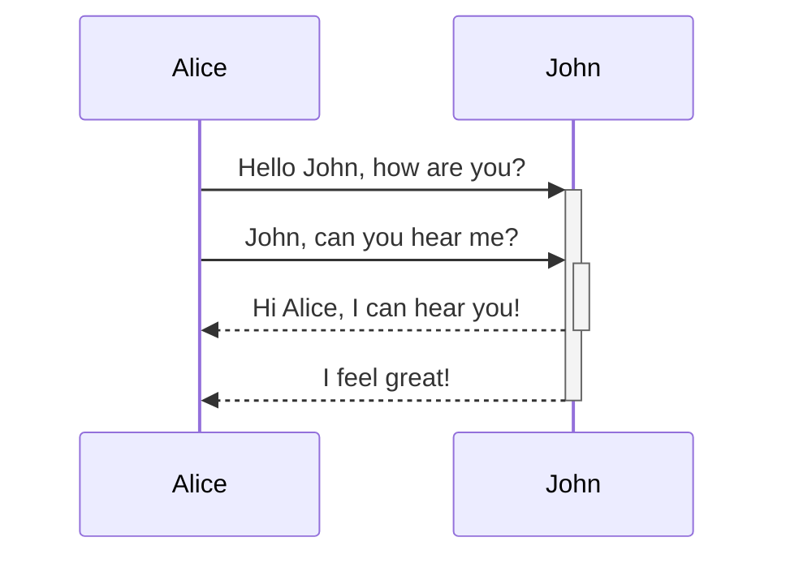

### 消息

| 类型 | 描述 |
|--|--|
| `->>` | 同步调用 |
| `-->>` | 同步返回 |
| `-)` | 异步调用 |
| `--))` | 异步返回 |

### 活动块

通过在箭头后面加`+/-`来形成活动块：

```plain
sequenceDiagram
    Alice->>+John: Hello John, how are you?
    John-->>-Alice: Great!
```

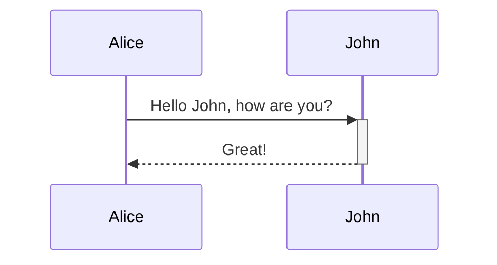

### 节点形状

#### 用户

```PALIN
sequenceDiagram
    actor Alice
    actor Bob
    Alice->>Bob: Hi Bob
    Bob->>Alice: Hi Alice
```

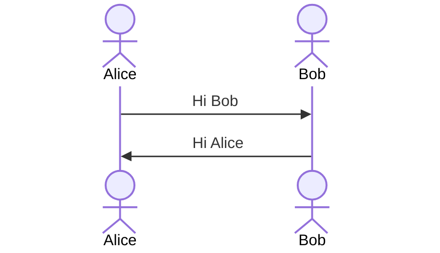

#### 参与者

```PALIN
sequenceDiagram
    participant Alice
    participant Bob
    Bob->>Alice: Hi Alice
    Alice->>Bob: Hi Bob
```

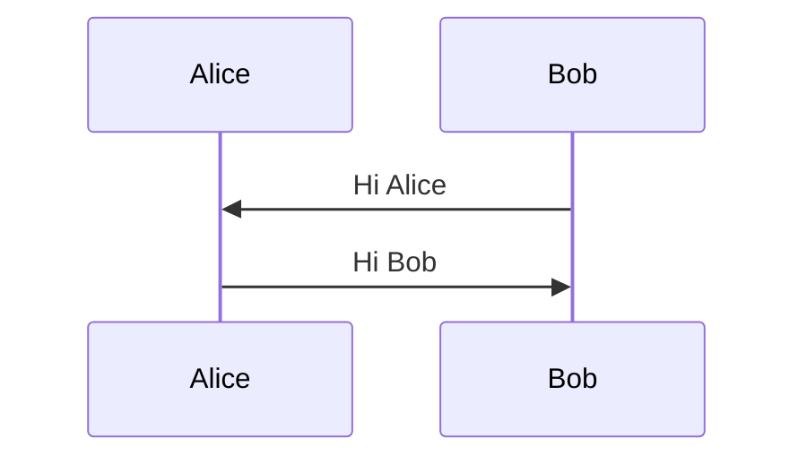

#### 边界

```PALIN
sequenceDiagram
    participant Alice@{ "type" : "boundary" }
    participant Bob
    Alice->>Bob: Request from boundary
    Bob->>Alice: Response to boundary
```

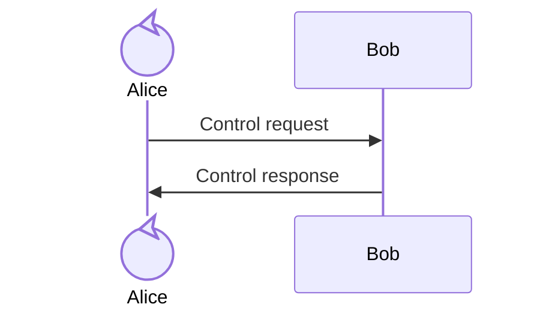

#### 控制

```PALIN
sequenceDiagram
    participant Alice@{ "type" : "control" }
    participant Bob
    Alice->>Bob: Control request
    Bob->>Alice: Control response
```

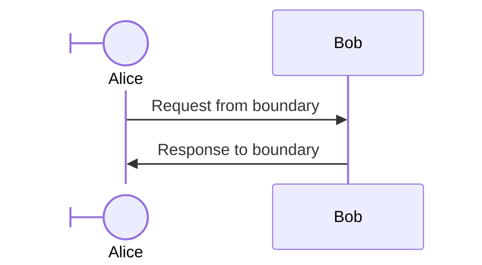

#### 实体

```PALIN
sequenceDiagram
    participant Alice@{ "type" : "entity" }
    participant Bob
    Alice->>Bob: Entity request
    Bob->>Alice: Entity response
```

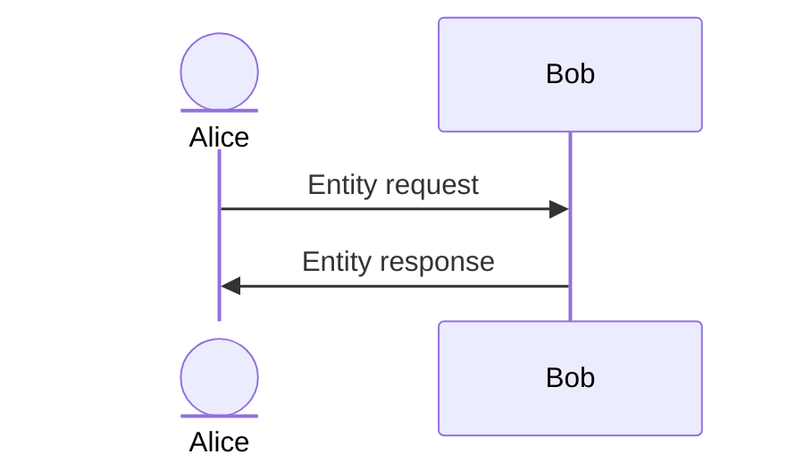

#### 数据库

```PALIN
sequenceDiagram
    participant Alice@{ "type" : "database" }
    participant Bob
    Alice->>Bob: DB query
    Bob->>Alice: DB result
```

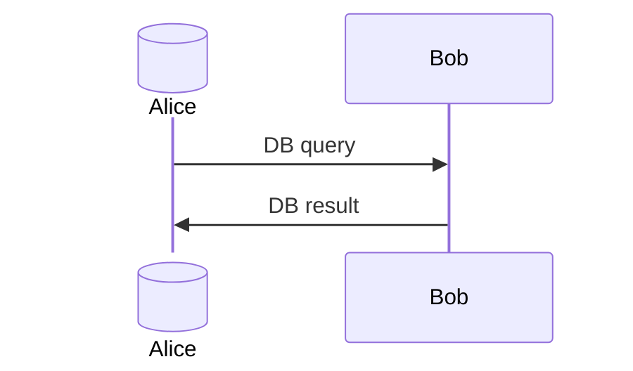

#### 队列

```PALIN
sequenceDiagram
    participant Alice@{ "type" : "queue" }
    participant Bob
    Alice->>Bob: Queue message
    Bob->>Alice: Queue response
```

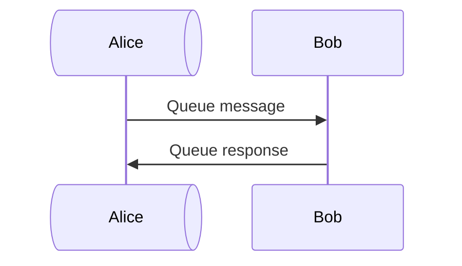

#### 集合

```PALIN
sequenceDiagram
    participant Alice@{ "type" : "collections" }
    participant Bob
    Alice->>Bob: Collections request
    Bob->>Alice: Collections response
```

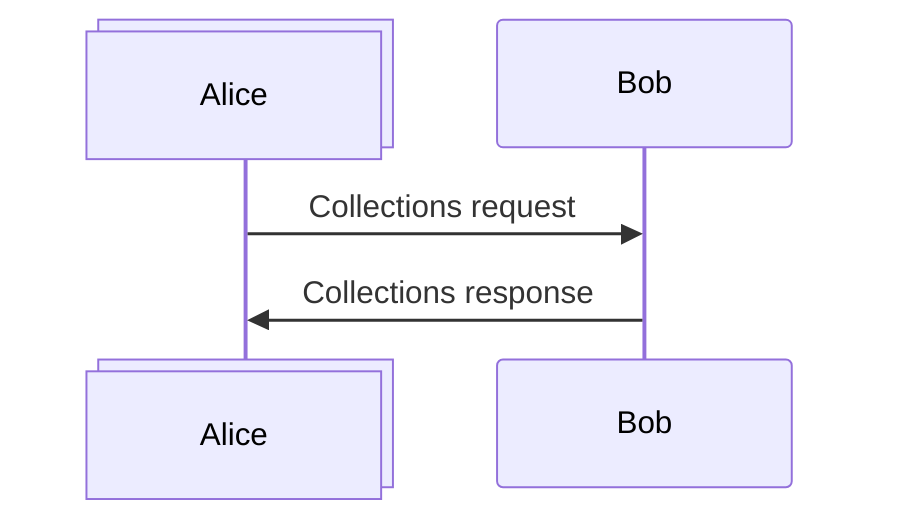

### 注解

```PALIN
sequenceDiagram
    participant John
    Note right of John: Text in note
```

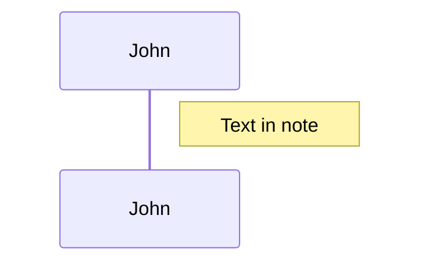

### 分支

```PALIN
sequenceDiagram
    Alice->>Bob: Hello Bob, how are you?
    alt is sick
        Bob->>Alice: Not so good :(
    else is well
        Bob->>Alice: Feeling fresh like a daisy
    end
```

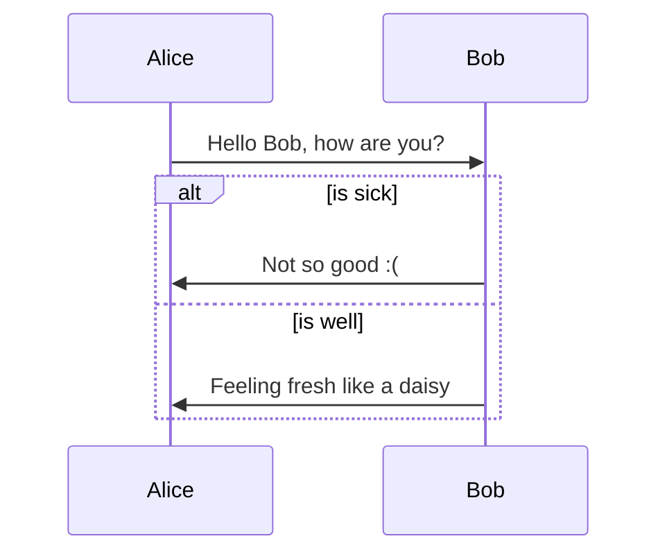

### 可选

```PALIN
sequenceDiagram
    Alice->>Bob: Hello Bob, how are you?
    Bob-->>Alice: Feeling fresh like a daisy
    opt Extra response
        Bob->>Alice: Thanks for asking
    end
```

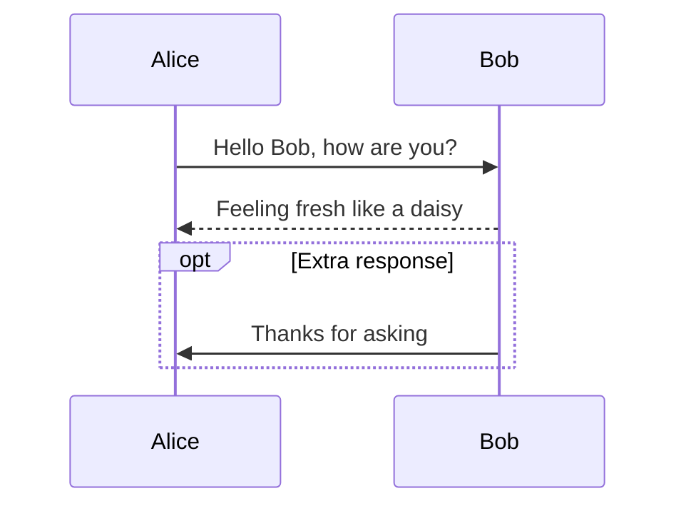

### 循环

```PALIN
sequenceDiagram
    Alice->John: Hello John, how are you?
    loop Every minute
        John-->Alice: Great!
    end
```

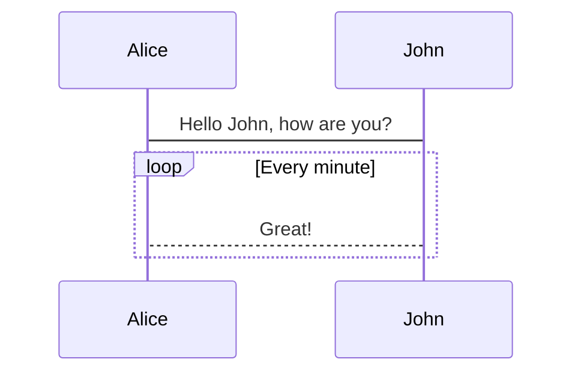

### 并发

```PALIN
sequenceDiagram
    par Alice to Bob
        Alice->>Bob: Hello guys!
    and Alice to John
        Alice->>John: Hello guys!
    end
    Bob-->>Alice: Hi Alice!
    John-->>Alice: Hi Alice!

```

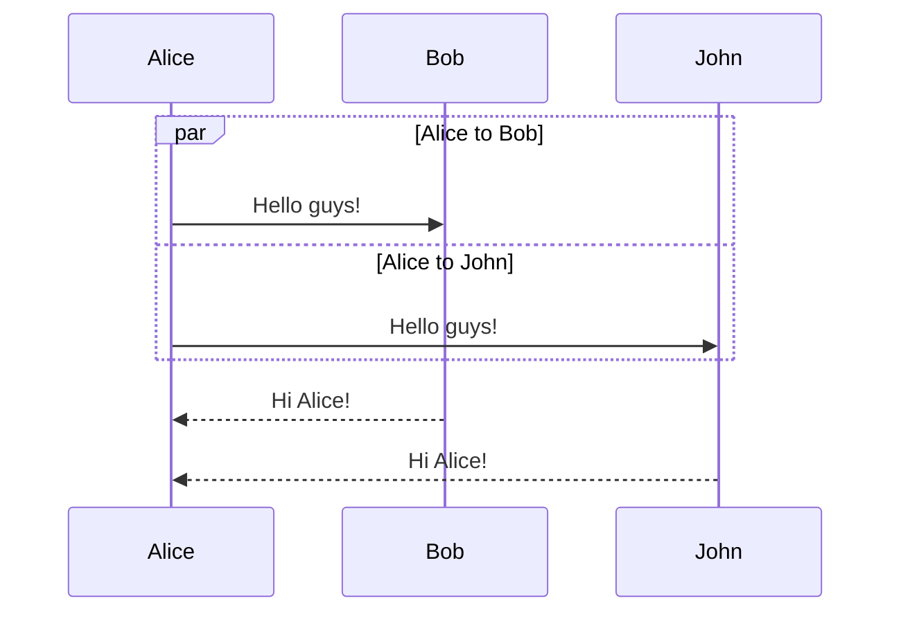

## 流程图

代码：

```plain
flowchart TD
    A[Christmas] -->|Get money| B(Go shopping)
    B --> C{Let me think}
    C -->|One| D[Laptop]
    C -->|Two| E[iPhone]
    C -->|Three| F[fa:fa-car Car]
```

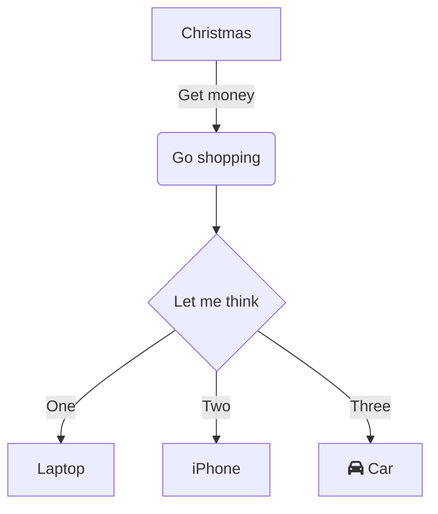

方向控制：

- TB 上到下
- TD 上到下
- BT 下到上
- RL 右到左
- LR 左到右

### 常用节点形状

开始节点：

```plain
flowchart TD
    node((start))
```

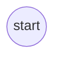

结束节点：

```plain
flowchart TD
    node(((end)))
```

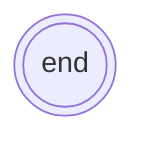

事件节点：

```plain
flowchart TD
    node(do something)
```

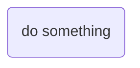

分支节点：

```plain
flowchart TD
    node{decision}
```

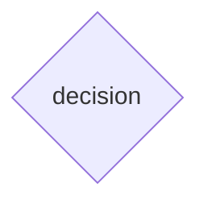

fork/join节点：

```plain
flowchart TD
    node@{ shape: fork, label: "Fork or Join" }

```

```mermaid
flowchart TD
    node@{ shape: fork, label: "Fork or Join" }
```

## 状态图

```plain
stateDiagram-v2
    direction LR
    [*] --> Still
    Still --> [*]
    Still --> Moving
    Moving --> Still
    Moving --> Crash
    Crash --> [*]
```

```mermaid
stateDiagram-v2
    direction LR
    [*] --> Still
    Still --> [*]
    Still --> Moving
    Moving --> Still
    Moving --> Crash
    Crash --> [*]
```

## 类图

```PLAIN
classDiagram
    Animal <|-- Duck
    Animal <|-- Fish
    Animal <|-- Zebra
    Animal : +int age
    Animal : +String gender
    Animal: +isMammal()
    Animal: +mate()
    class Duck{
      <<Interface>>
      +String beakColor
      +swim()
      +quack()
    }
    class Fish{
      -int sizeInFeet
      -canEat()
    }
    class Zebra{
      +bool is_wild
      +run()
    }
```

```mermaid
classDiagram
    class Animal
    <<Interface>> Animal 
    Animal <|-- Duck
    Animal <|-- Fish
    Animal <|-- Zebra
    Animal : +int age
    Animal : +String gender
    Animal: +isMammal()
    Animal: +mate()
    class Duck{
      <<Service>>
      +String beakColor
      +swim()
      +quack()
    }
    class Fish{
      -int sizeInFeet
      -canEat()
    }
    class Zebra{
      +bool is_wild
      +run()
    }
```

### 关系定义

```PLAIN
classDiagram
classA <|-- classB
classC *-- classD
classE o-- classF
classG <-- classH
classI -- classJ
classK <.. classL
classM <|.. classN
classO .. classP
```

```mermaid
classDiagram
classA <|-- classB
classC *-- classD
classE o-- classF
classG <-- classH
classI -- classJ
classK <.. classL
classM <|.. classN
classO .. classP

```

### 可见性

- `+`: public
- `-`: private
- `#`: protected
- `~`: package

## 用户旅行图

```PLAIN
journey
    title My working day
    section Go to work
      Make tea: 5: Me
      Go upstairs: 3: Me
      Do work: 1: Me, Cat
    section Go home
      Go downstairs: 5: Me
      Sit down: 5: Me
```

```mermaid
journey
    title My working day
    section Go to work
      Make tea: 5: Me
      Go upstairs: 3: Me
      Do work: 1: Me, Cat
    section Go home
      Go downstairs: 5: Me
      Sit down: 5: Me
```